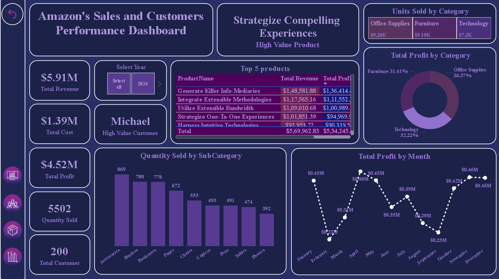

# 📊 Power BI Project – Final Project Dashboard

**File Name:** `Final_project_powerBi_01.pbix`  
**Prepared by:** Mihir Limje  
**Date:** June 2025

---

## 📌 Project Objective

This Power BI report presents a comprehensive, interactive analysis of key performance indicators across relevant business dimensions. It includes time-based comparisons, advanced DAX measures, and segmentation insights to help decision-makers understand trends and performance drivers.

---
---


## 🧩 Data Model Overview

**Note:** Actual table names should be updated based on your model view.

**Fact Tables:**
- `Sales` (or your main transactional table)

**Dimension Tables:**
- `Date`
- `Customer`
- `Product`
- `Region`

These tables are connected using a star schema via primary-foreign key relationships.

---

## 🧠 Key DAX Measures

```DAX
Total Sales = SUM(Sales[SalesAmount])

Sales Last Year = 
CALCULATE([Total Sales], SAMEPERIODLASTYEAR('Date'[Date]))

Running Total Sales = 
CALCULATE([Total Sales],
    DATESBETWEEN('Date'[Date],
    DATE(YEAR(MIN('Date'[Date])), 1, 1),
    MAX('Date'[Date]))
)

Sales Category =
SWITCH(TRUE(),
    [Total Sales] < 20000, "Low",
    [Total Sales] < 50000, "Medium",
    "High"
)

Average Sales per Customer =
AVERAGEX(VALUES(Customer[CustomerID]), [Total Sales])
```

---

## 📈 Visualizations Used

Only **Matrix visualizations** are used for this report. Each matrix includes grouped views of:

- Region
- Month
- Product Category
- Customer Segment

Measures included:

- Total Sales
- Sales Category
- Last Year Sales
- Running Total
- Average per Customer
- SumX-based Product-Level Total

---

## 📅 Time Intelligence

This report includes:

- Year-over-Year comparison using `SAMEPERIODLASTYEAR()`
- Last 3-month sales using `DATESINPERIOD()`
- Cumulative totals using `DATESBETWEEN()`

A properly marked Date table is used for all time intelligence calculations.

---

## ⚙️ Technical Stack

- Power BI Desktop
- Star Schema Model
- DAX Expressions (CALCULATE, SWITCH, SUMX, AVERAGEX, RELATED, FILTER)

---

## 📝 Notes

- All output is restricted to Matrix visuals.
- Dynamic formatting and prefixing are done via DAX.
- Actual table and column names should be filled in after opening the PBIX file in Power BI.

---
